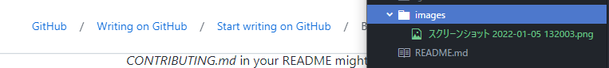

# portfolio
ポートフォリオページ

atomで追加

# 見出し１

## 見出し２

### 見出し３

## 書式

**太字** **bold**

*斜体* *Italic*

~~打消し戦~~ ~~Strikethrough~~

## コードブロック

これは`code block withinline`です。

```cs
staring a="これはC#(cs)初期のブロック";
```

### リンク

[cluster 及川](https://cluster.mu/w/a9426dc3-ee56-4cf7-a02c-5636befe1374)

### 画像




画像はこのフォルダー内に含めて相対リンクで示す。

マークダウン内にはimgタグが使える。画像サイズ指定をしたい場合にはimgタグを使う


### 箇条書き

### 通常リスト


- 箇条書き
- 箇条書き2
- 箇条書き3

### 通し番号付きリスト

1. 通し番号1
1. 通し番号2
1. 通し番号3

### 途中から番号を始める

100. 好きな値から
100. 始められる

### 字下げ

- 箇条書き
  - 箇条書き
   - 箇条書き


 ### タスクリスト

 - [ ] タスク1
 - [ ] タスク２
 - [x] タスク３

 ### 段落

 １行だけの改行は
 効果がない。

 改行するには

 空行を１行入れる。

 ### セパレーター

 ---

 ***

 ### 補足(Footnotes)

 補足[^1]の表記。

 [^1]: 補足をページ末に記載
wiki[^2]などで見るやつ

[^2]: 補足をページ末に記載

## 表

|表の|書式|
 |:-:|:-|
 |これを|知っていると|
 |表現の幅が広がって|便利。|

 
