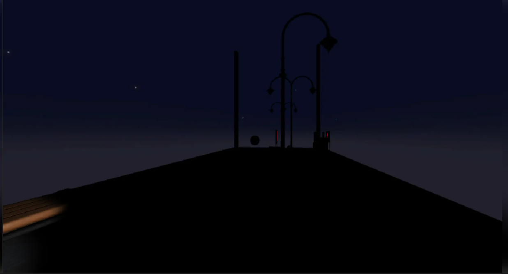
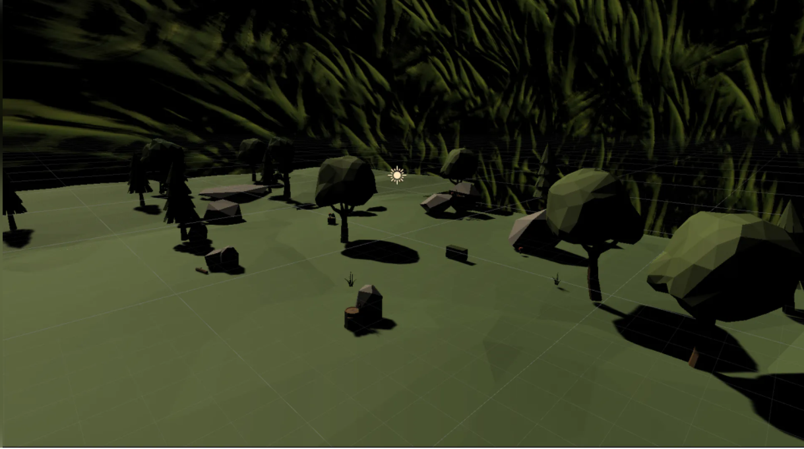
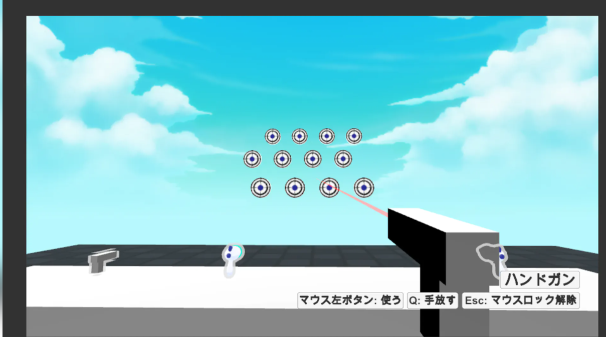

# Portfolio

- 及川颯大
- 連絡先 Email [oikw](sut11231123@gmail.com)
- 専門学校デジタルアーツ東京 ゲームプログラムコース 2023年卒業予定

## 資格

- 基本パソコン検定3級 合格

## スキル
- C#
  - 利用歴1年
  - どの程度使えるか
- Unity
  - 利用歴1年
  - Visual Studioで独自のツールの作成が可能
- C/C++
  - 利用歴1年
  - コンソールで簡単なデータ処理プログラムを開発

  - 簡単なミニゲームの開発
- cluster
  - 利用歴1年
  - ミニワールドの作成
  - チーム作成によるワールドの作成

## 取り組んでいるテーマ
- メタバースによる多様性のあるプレイヤー制御

## 作品リスト

### 作品名1

[train station 及川](https://cluster.mu/w/10b37288-19d3-4469-b108-f56a11627e27)

- 作品概要

- 開発環境：cluster
- 開発期間：1カ月
- 制作人数：6人
- 制作場所：入り口のワールドを担当

### 作品名2

[forest 及川](https://cluster.mu/w/a9426dc3-ee56-4cf7-a02c-5636befe1374)

- 作品概要

草原を乗り物で移動できるミニワールドです
途中で降りても乗り物は元の位置に戻ります

- 開発環境：cluster
- 制作人数：1人
- 開発期間：5日

### 作品名3

[shooting demo 及川](https://cluster.mu/w/7745d022-9941-4291-a852-d96221edb9aa)

- 作品概要

簡単な的当てゲームです
4種類の銃を使ってターゲットに打ってください

操作方法十字キー 移動

- 右クリック 銃をとる 銃を撃つ

- 開発環境：cluster
- 制作人数：1人
- 開発期間：4日

## 連絡先
- E-mail [a@a.a](sut11231123@gmail.com)
